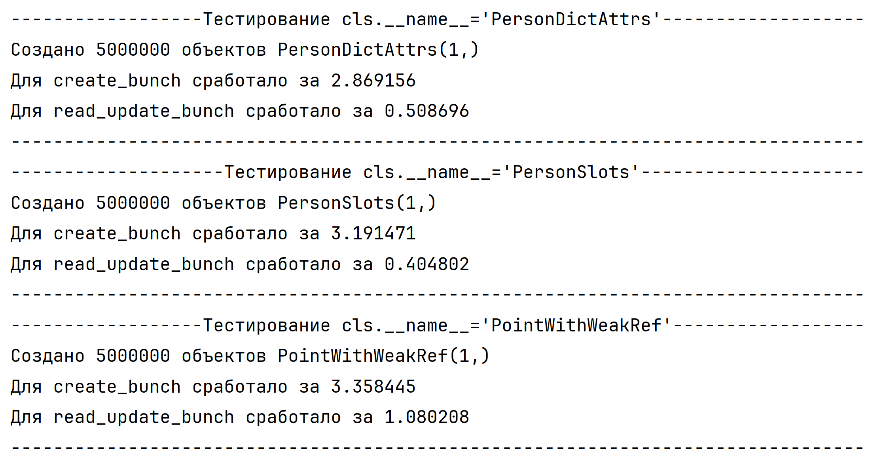

# Задание 1
Время выполнения представлено на скриншоте:

### Создание
Как видим, объекты со слотами создаются немного медленне, чем объекты без слотов. Хотя ожидалось, что будет наоборот, так как объекты со слотами не создают словарь для хранения атрибутов.  Вероятно, это погрешность измерения или внутренняя оптимизация питона.

Создание объектов со слабой ссылкой заняло больше всего времени.

### Чтение и обновление
На чтение и обновление атрибутов объектов без слотов уходит меньше времени.
Класс со слабыми ссылками занимает больше времени на чтение и обновление, чем другие.

# Задание 2

## Результаты профилирования

### Обычный класс

### Класс со слотами

### Класс со слабыми ссылками

Так как в классе со слабыми ссылками используется property, это увеличивает общее время выполнения на ~2 секунды.
